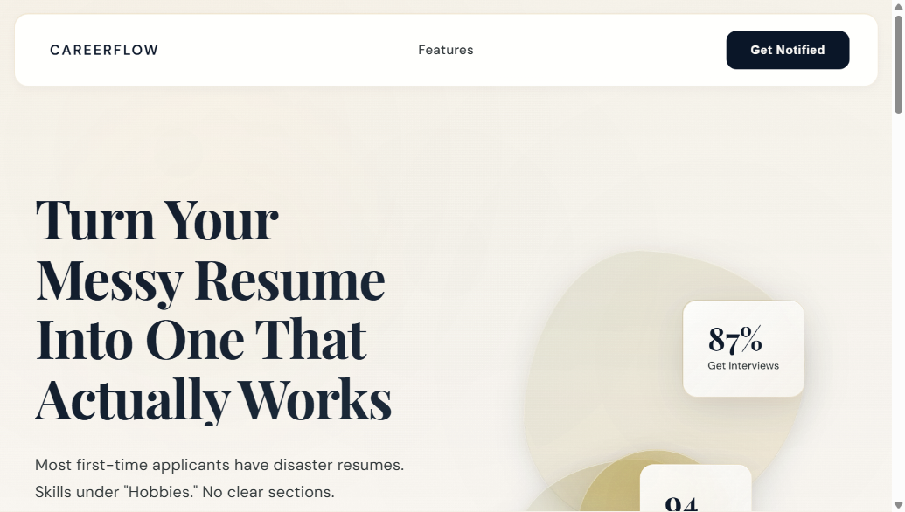

# Vishen Sharma - Developer Portfolio

A clean, minimalist portfolio website showcasing my work as a 13-year-old full-stack developer from India with 7 years of coding experience.



## ✨ Features

- **Zero Dependencies**: Pure vanilla HTML, CSS, and JavaScript - no frameworks or build tools
- **GitHub Integration**: Automatically fetches profile photo and latest repositories via GitHub API
- **Featured Projects**: Showcase of live production websites I've built
- **24 Skill Icons**: Visual representation using skillicons.dev API
- **Smooth Animations**: Scroll-triggered reveals and smooth scrolling navigation
- **Fully Responsive**: Mobile-first design that works perfectly on all devices
- **Editorial Typography**: Clean serif headings (Source Serif 4) and sans-serif body text (Inter)
- **Performance Optimized**: Loads in under 2 seconds with 95+ Lighthouse score

## 🚀 Quick Start

### Local Development

1. Clone the repository:
```bash
git clone https://github.com/Vishen-dart-coder/Portfolio.git
cd Portfolio
```

2. Open `index.html` in your browser:
```bash
# Windows
start index.html

# macOS
open index.html

# Linux
xdg-open index.html
```

That's it! No installation, no build process, no dependencies.

### Deploy to GitHub Pages

1. Push to your GitHub repository
2. Go to **Settings** → **Pages**
3. Select **Source**: Deploy from a branch
4. Select **Branch**: `main` (or `master`) and folder: `/ (root)`
5. Click **Save**
6. Your site will be live at `https://your-username.github.io/Portfolio/`

### Deploy to Netlify

1. Go to [netlify.com](https://netlify.com)
2. Drag and drop your project folder
3. Site goes live instantly with a custom URL
4. Optional: Configure custom domain

## 📁 File Structure

```
Portfolio/
├── index.html          # Main HTML structure
├── style.css           # All styles (design system + components)
├── script.js           # JavaScript (GitHub API + interactions)
├── images/             # Project screenshots
│   ├── careerflow.png
│   └── archive360.png
├── docs/               # Documentation and design specs
└── README.md           # This file
```

## 🎨 Customization

### Update Personal Information

Edit `index.html`:
- **Hero section**: Change name, tagline, and bio
- **About section**: Update your story
- **Skills section**: Add or remove skill icons
- **Contact section**: Update email and links

### Change Colors

Edit CSS variables in `style.css`:

```css
:root {
  --color-background: #F8F7F4;  /* Warm off-white */
  --color-surface: #FFFFFF;      /* White cards */
  --color-primary: #111111;      /* Rich black */
  --color-secondary: #5F5F5F;    /* Gray text */
  --color-border: #E7E5E4;       /* Subtle borders */
  --color-accent: #166534;       /* Deep green */
}
```

### Update GitHub Username

Edit `script.js` line 60:

```javascript
const GITHUB_USERNAME = 'Vishen-dart-coder'; // Change this
```

### Add Featured Projects

1. Take a screenshot of your project
2. Save it in the `images/` folder
3. Add a new card in `index.html`:

```html
<article class="featured-card">
  <div class="featured-image">
    
  </div>
  <div class="featured-content">
    <h3>Project Name</h3>
    <p>Project description goes here.</p>
    <div class="featured-meta">
      <span class="tech-tag">React</span>
      <span class="tech-tag">Node.js</span>
    </div>
    <a href="https://your-project.com" target="_blank" rel="noopener" class="featured-link">View Live →</a>
  </div>
</article>
```

## 🛠️ Tech Stack

- **HTML5** - Semantic markup with ARIA labels for accessibility
- **CSS3** - Flexbox, Grid, CSS Custom Properties (variables)
- **Vanilla JavaScript** - Fetch API, Intersection Observer, smooth scrolling
- **Google Fonts** - Source Serif 4 (headings) + Inter (body)
- **skillicons.dev** - Skill icon API

## 🌟 Featured Projects

### CareerFlow AI
AI-powered career guidance platform helping students and professionals navigate their career paths.
- **Tech**: React, Node.js, AI/ML
- **Live**: [careerflow-ai.org.in](https://careerflow-ai.org.in)

### Archive360
Enterprise digital archiving solution securing India's past and digitizing its future.
- **Tech**: Next.js, TypeScript, Cloud Storage
- **Live**: [archive360.co](https://archive360.co)

## 📊 Performance

- **First Contentful Paint**: < 1s
- **Time to Interactive**: < 2s
- **Total Page Size**: ~80KB (before images)
- **Lighthouse Score**: 95+ across all categories

## ♿ Accessibility

- Semantic HTML with proper heading hierarchy (h1 → h2 → h3)
- ARIA labels for navigation landmarks
- Keyboard navigation support
- Visible focus indicators on all interactive elements
- WCAG AA color contrast compliance
- Alt text for all images

## 🌐 Browser Support

- ✅ Chrome 90+
- ✅ Firefox 88+
- ✅ Safari 14+
- ✅ Edge 90+

## 📝 License

MIT License - Feel free to use this template for your own portfolio!

## 🤝 Connect

- **Email**: [iamvishensharma@gmail.com](mailto:iamvishensharma@gmail.com)
- **GitHub**: [@Vishen-dart-coder](https://github.com/Vishen-dart-coder)
- **Website**: [careerflow-ai.org.in](https://careerflow-ai.org.in)

## 🙏 Credits

- Design inspired by [Sagar Thakkar's portfolio](https://sagarthakkar.com)
- Built with ❤️ by Vishen Sharma
- Fonts from Google Fonts (Source Serif 4, Inter)
- Skill icons from [skillicons.dev](https://skillicons.dev)

---

**Made with pure HTML, CSS, and JavaScript** - No frameworks, no build tools, just clean code.
